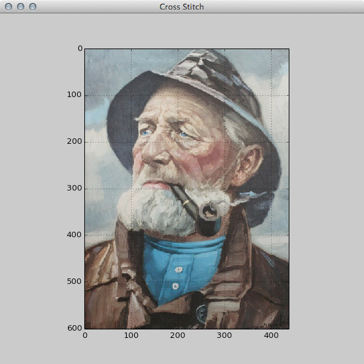
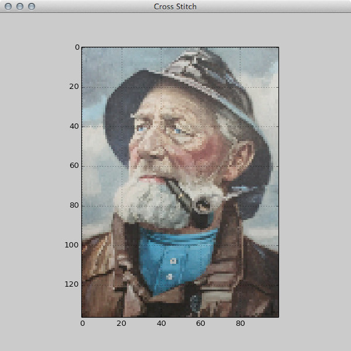
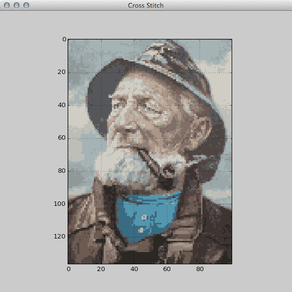

cross-stitch
============

A Python application to turn your images into patterns for cross stitching.

https://github.com/anders-dc/cross-stitch

Download builds
---------------
There are pre-compiled standalone versions available for Mac OS X and Windows:
  - Mac OS X (64 bit): https://cs.au.dk/~adc/files/cross-stitch-osx.zip (143 MB)
  - Windows (32 bit, works on 64 bit also): https://cs.au.dk/~adc/files/cross-stitch-win.zip (47 MB)

Requirements
------------
Python 2 or 3, Numpy, Scipy, Matplotlib, and wxPython.

To install these dependencies in Debian and its derivatives, run:

  $ sudo apt-get install python python-numpy python-scipy python-matplotlib python-wx

License
-------
GNU Public License version 3 or newer. See LICENSE.txt for details.

Author
------
Anders Damsgaard (andersd@riseup.net)

Todo
----
Show color-by-color output images. Show product names of needed yarn colors.

Example
-------

Original image:

Down sampled image:

Color reduced image:

