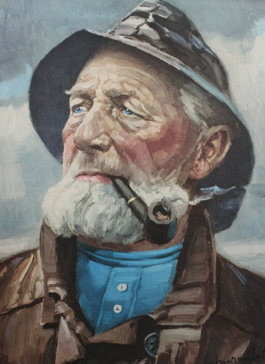
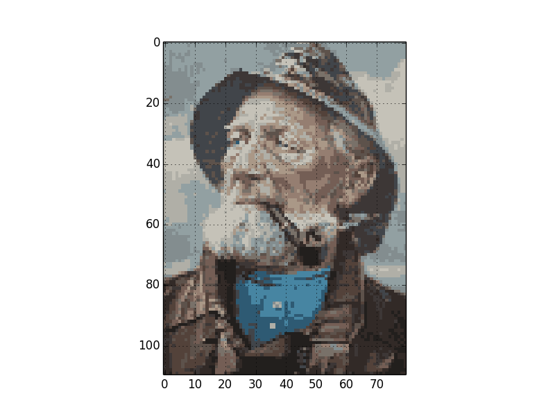

cross-stitch
============

A Python application to turn your images into patterns for cross stitching.

https://github.com/anders-dc/cross-stitch

Requirements
------------
Python 2 or 3, Numpy, Scipy, and Matplotlib.

To install these dependencies in Debian and its derivatives, run:

  $ sudo apt-get install python python-numpy python-scipy python-matplotlib

License
-------
GNU Public License version 3 or newer. See LICENSE.txt for details.

Author
------
Anders Damsgaard (andersd@riseup.net)

Todo
----
Add color processing functions to enhance colors and limit the number of colors.
Show product names of needed yarn colors.

Usage
-----

  usage: cross-stitch.py [-h] --infile file --outfile file [--width WIDTH]
                       [--ncolors NCOLORS]

Downsamples and modifies an image in order to create a pattern for cross
stitching.

optional arguments:
  -h, --help            show this help message and exit
  --infile file, -i file
                        input image to process
  --outfile file, -o file
                        save processed image as file
  --width WIDTH, -w WIDTH
                        canvas width, default value = 20
  --ncolors NCOLORS, -c NCOLORS
                        number of colors in output image, default value = 16

Example
-------

  $ ./cross-stitch.py -i fiskeren.jpg -o fisker-pattern.py -w 80 -c 16

